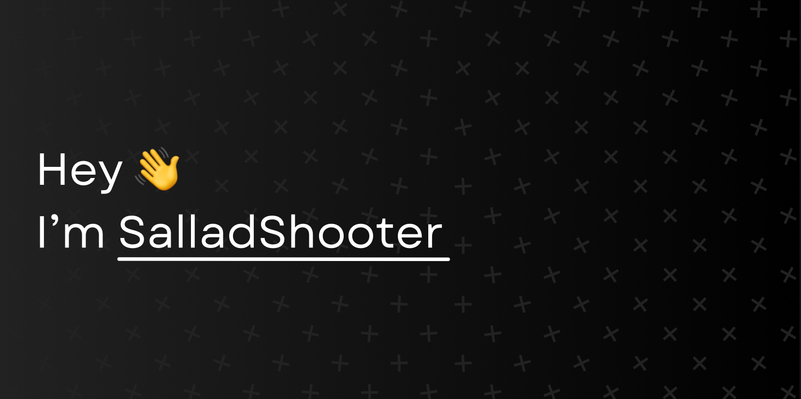

### 

Am I an appliance or am I human? I have been programming for over 5 years! I mostly work on small projects, but have a few large ones in the works.

## 🛠️ What I'm Working On

- [phyal](https://phyal.vercel.app) an Opensource Python Framework that removes the need for HTML
- [Naviminga](https://salladshooter.github.io/Naviminga), a website for my constructed language (conlang), Naviminga
- Much more...

### 💻 Coding Languages

- Python [ FLUENT ]
- HTML [ FLUENT ]
- CSS [ FLUENT ]
- Rust [ BASIC ]
- C [ BASIC ]
- JavaScript [ BASIC ]
- ReactJS [ BASIC ]
- TailwindCSS [ BASIC ]

### 🌎 Languages

- English
  #### Partial
  - Norsk (Bokmål) / Norwegian Bokmål [ B1-B2 ]
  - Español / Spanish [ A2-B1 ]
 
### 🏠 Projects
<!--  -->

  
### 📊 Stats

<!-- 

 -->

